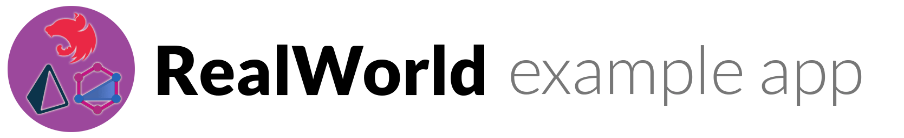

# 

> ### NestJS, Prisma and GraphQL codebase containing real world examples (CRUD, auth, advanced patterns, etc) that adheres to the [RealWorld](https://github.com/gothinkster/realworld) spec and API.

### [Demo](https://nest-prisma-realworld.herokuapp.com/api)

This codebase was created to demonstrate a fully fledged fullstack application built with **NestJS, Prisma and GraphQL** including CRUD operations, authentication, routing, pagination, and more.

We've gone to great lengths to adhere to the **NestJS, Prisma and GraphQL** community styleguides & best practices.

For more information on how to this works with other frontends/backends, head over to the [RealWorld](https://github.com/gothinkster/realworld) repo.

## Getting started

```sh
cp .env.example .env
# fill env variables in `.env` file
npm ci
npm start
# http://localhost:3000/api
```

## How it works

Application is written using NestJS, Prisma and GraphQL, but since [backend API specification](<(https://github.com/gothinkster/realworld/tree/master/api)>) requires REST, graphql endpoint wrapped by REST API. It is the facade and work as microservice which sends all requests
to graphql api.

### Project Structure

-   `src` - Main application source code
-   `src/api` - REST API wrapper under main application
-   `src/app.environment.ts` - Application config file
-   `prisma` - DB toolkit to query, migrate and model your database
-   `@generated` - Generated code

## Run realword API end-to-end tests

```sh
1: npm run start:dev
2: npm run api:spec
```

## Old Versions

-   [v6](https://github.com/unlight/nestjs-graphql-prisma-realworld-example-app/tree/v6) Nest.JS v6, TypeGraphQL, TSLint

## Known Issues

-   Passwords is not hashed
-   GraphQL schema user's field `username` renamed to `name`

## Resources

-   [Backend API spec](https://github.com/gothinkster/realworld/tree/master/api)
-   [Postman collection](https://github.com/gothinkster/realworld/blob/master/api/Conduit.postman_collection.json) that you can use to test your API endpoints as you build your app.

## Todo

-   Why do we need copy migrations to docker?
-   ArticleService.updateArticle() Updating tags does not working check it later
-   Use case from clean architecture mybe use userservice.follow

## Scripts

```
autocannon -m POST -i body.json -H "Content-Type: application/json" http://localhost:3000/graphql
```
